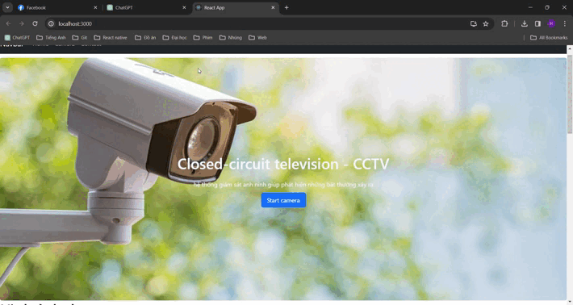

# Giám sát an ninh từ CCTV

## Tóm tắt
Trong thời đại của công nghệ và mạng xã hội, việc giám sát và đảm bảo an
ninh trở thành một thách thức ngày càng lớn, đặc biệt là trong các môi trường
đông người như các sự kiện công cộng, trung tâm mua sắm, và các khu vực công
cộng khác. Trong số các thách thức an ninh này, việc phát hiện hành vi bạo lực
đóng một vai trò quan trọng, nhằm giúp ngăn chặn sự cố và bảo vệ an toàn của
mọi người. Bài toán phát hiện hành vi bạo lực đặt ra một loạt các thách thức đối với các
hệ thống giám sát an ninh. Các hành vi bạo lực có thể biến đổi từ các hành động
nhỏ như cãi nhau, xô đẩy, đánh nhau, đến các hành vi nghiêm trọng hơn như sử
dụng vũ khí, hành hung, hay thậm chí là tấn công khủng bố. Việc phát hiện các
hành vi này đòi hỏi các hệ thống phát hiện và phân loại phải nhận diện được các
biểu hiện và đặc điểm của hành vi bạo lực trong môi trường đa dạng và động đặc
của các đám đông. Dự án này được tôi xây dựng nhằm mục đích cải thiện tình trạng anh ninh tại một số khu vực trọng điểm, nhiều người qua lại. 
## Dataset

## Theory

## Install

### Requirement
- python >= 3.6, django >=5.0.3, keras, djangorestframework >= 3.15.0, ultralytics, ...

Cài đặt các thư viện cần thiết
1. Cài đặt thư viện cho python
     ```shell
     cd ViolenceDetection
     pip install -r requirements.txt
     ```
### Setting
1. **Train**

2. **Test**
   
## How to run project 
1. **Backend**

2. **Frontend**


   
## References
- [Django Framework Documentation](https://docs.djangoproject.com/en/5.0/)
- [Rest Framework Documentation](https://www.django-rest-framework.org/)
- [React js Documentation](https://react.dev/)
## Contact
If you have any questions or suggestions, please feel free to contact us at hieu2k2boss@gmail.com. We welcome your feedback and contributions to improve the Send-Mail backend application.

Thank you for using and exploring the application!
